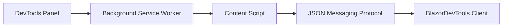

# Blazor Dev Tools

> **Early scaffolding — not yet functional.** Component inspection, parameter viewing, and dependency-injection introspection are planned but not implemented yet.

**Blazor Dev Tools** brings a [React DevTools](https://react.dev/learn/react-developer-tools)-like experience to [Blazor](https://dotnet.microsoft.com/apps/aspnet/web-apps/blazor) applications. Inspect your component tree, view parameters and cascading values, and understand what the dependency injection container resolved — all from a dedicated panel inside Chrome DevTools.

The project has two main parts:

| Part | Location | Role |
|------|----------|------|
| Chrome Extension | `src/Extension` | DevTools panel, background relay, and content-script bridge |
| Blazor library | `src/BlazorDevTools.Client` | Hooks into the Blazor runtime and exposes inspection data via a JSON protocol |

Sample apps under `samples/` exercise both **WebAssembly** and **Server** hosting models. Projects multi-target **.NET 9** and **.NET 10**.

## Getting Started

### Prerequisites

- [Google Chrome](https://www.google.com/chrome/) (or a Chromium-based browser with DevTools extension support)
- [.NET SDK](https://dotnet.microsoft.com/download) 9.0 or later (9.0 and 10.0 are supported)

### Build from source

```bash
# Restore and build the solution
dotnet build BlazorDevTools.sln

# Run the WebAssembly sample
dotnet run --project samples/BlazorDevTools.Sample.Wasm

# Or run the Server sample
dotnet run --project samples/BlazorDevTools.Sample.Server
```

### Load the Chrome extension

Build the TypeScript extension scripts first:

```bash
cd src/Extension
npm install
npm run build
```

Then load the extension in Chrome:

1. Open `chrome://extensions`
2. Enable **Developer mode**
3. Click **Load unpacked**
4. Select the `src/Extension` folder

Re-run `npm run build` (or `npm run watch`) after changing extension TypeScript sources.

Open Chrome DevTools on a running sample app. A **Blazor** panel will appear (scaffolding UI only for now).

### Verify the messaging bridge (manual smoke test)

After building, you can confirm the C# → panel pipe with the **Server** sample:

```bash
dotnet build samples/BlazorDevTools.Sample.Server/BlazorDevTools.Sample.Server.csproj -f net10.0
dotnet run --project samples/BlazorDevTools.Sample.Server -f net10.0
```

1. Load the unpacked extension from `src/Extension` (see above).
2. Open the sample app in Chrome, then open DevTools and select the **Blazor** panel (registers the panel port). If the app loaded before the panel was open, hard-refresh the tab; the background worker also buffers the last envelope per tab and flushes when the panel connects.
3. Logs from `panel.js` appear in the **panel page's own console**, not the inspected page console: right-click inside the Blazor DevTools panel → **Inspect** → **Console** (DevTools-on-DevTools).
4. Confirm a mock `componentTreeUpdate` message with a `root` payload (App → MockComponent) is logged.

> NuGet packaging is not available yet. Reference `src/BlazorDevTools.Client` as a project reference until the library is published.

## Architecture Overview

The Chrome extension knows nothing about Blazor internals. It consumes a standardized JSON messaging protocol. The Blazor library handles reflection, runtime inspection, and dependency-injection introspection.



**Message flow (planned):**

1. **DevTools panel** (`panel.html` / `panel.js`) — UI for the component tree and property inspector
2. **Background service worker** (`background.js`) — relays messages between the panel and the inspected tab
3. **Content script** (`content.js`) — injected into the page; bridges to the in-page Blazor runtime
4. **Blazor library** (`BlazorDevTools.Client`) — inspects components and serializes state into the JSON protocol

Wasm vs. Server hosting is abstracted inside the library so both sample apps can be exercised with the same extension.

## Contributing

This project is in early development. Interfaces and the messaging protocol are not finalized.

- Open an issue to discuss larger changes before submitting a PR
- Keep pull requests focused and small
- Follow the conventions in `.cursor/rules/architecture.mdc`

Contributions are welcome!

## License

Licensed under the [GNU Lesser General Public License v3.0 (LGPL-3.0)](LICENSE). See [COPYING](COPYING) and [COPYING.LESSER](COPYING.LESSER) for the full license texts.
