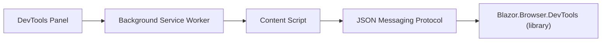

# Blazor Dev Tools

[](https://ko-fi.com/S6S3XYOL5)
[](https://www.nuget.org/packages/Blazor.Browser.DevTools)
[](https://www.gnu.org/licenses/lgpl-3.0)

A [React DevTools](https://react.dev/learn/react-developer-tools)-like experience for [Blazor](https://dotnet.microsoft.com/apps/aspnet/web-apps/blazor) applications (Server and WebAssembly). Inspect your component tree, view parameters and cascading values, and understand what the dependency injection container resolved, all from a dedicated **Blazor** panel inside Chrome DevTools.

Blazor Dev Tools has two cooperating parts:

| Part | Location | Role |
|------|----------|------|
| Blazor library (NuGet) | `Blazor.Browser.DevTools` | Hooks into the Blazor runtime, inspects components via reflection, and exposes inspection data over a JSON protocol |
| Chrome Extension | `src/Extension` | DevTools panel, background relay, and content-script bridge that renders the inspection data |

## Features

- **Cross-Platform Blazor Support**: Works with Blazor Server and Blazor WebAssembly
- **Component Tree Inspection**: Live, nested view of the rendered component hierarchy
- **Parameter & Cascading Value Viewing**: See parameter names, declared types, and serialized values per component
- **Dependency Injection Introspection**: Inspect injected services with their declared service type and resolved implementation type
- **Element Picker & Highlight Overlay**: Pick an element on the page and highlight the matching component (and vice versa) using best-effort CSS locators
- **Development-Only by Default**: A runtime gate keeps Dev Tools off outside `Development`, so nothing is exposed in production
- **Multi-Targeted**: Ships for **.NET 9** and **.NET 10**
- **Clean DI Registration**: A single `builder.Services.AddBlazorDevTools()` call and one `<DevToolsInitializer />` component

## Installation

Install the NuGet package into your Blazor app:

```bash
dotnet add package Blazor.Browser.DevTools
```

Then install the **Blazor Dev Tools** Chrome extension (see [Installing the Chrome extension](#installing-the-chrome-extension)).

## Quick Start

### 1. Register Services

In your `Program.cs`:

```csharp
using BlazorDevTools.Client.DependencyInjection;

builder.Services.AddBlazorDevTools();
```

> Registration is safe in any environment. Dev Tools stays disabled at runtime unless the host environment is `Development` (see [Security](#security)).

### 2. Add the Initializer Component

Render `<DevToolsInitializer />` once, somewhere that runs after the app has rendered (for example, your root `App.razor` or `MainLayout.razor`). The initializer wires up the JS bridge, watches for navigation, and pushes component tree snapshots to the extension.

```razor
@* MainLayout.razor (or App.razor) *@
<DevToolsInitializer />
```

Make sure the namespace is available (via `_Imports.razor` or an inline `@using`):

```razor
@using BlazorDevTools.Client
```

### 3. Open the Panel

1. Build and run your app.
2. Install/load the Chrome extension (below).
3. Open Chrome DevTools (F12) on your app and select the **Blazor** panel.

You should see the live component tree. Selecting a component shows its parameters, cascading values, and injected services.

## Installing the Chrome extension

The extension is built from TypeScript sources under `src/Extension`.

```bash
cd src/Extension
npm install
npm run build
```

Then load it in Chrome:

1. Open `chrome://extensions`
2. Enable **Developer mode**
3. Click **Load unpacked**
4. Select the `src/Extension` folder

Re-run `npm run build` (or `npm run watch`) after changing extension TypeScript sources.

> If the app loaded before the panel was open, hard-refresh the tab. The background worker buffers the last envelope per tab and flushes it when the panel connects.

## Integration Scenarios

### Scenario 1: New Blazor Server App

#### Step 1: Create New Project
```bash
dotnet new blazor -n MyBlazorApp
cd MyBlazorApp
```

#### Step 2: Install Package
```bash
dotnet add package Blazor.Browser.DevTools
```

#### Step 3: Configure Services
Update `Program.cs`:
```csharp
using BlazorDevTools.Client.DependencyInjection;

var builder = WebApplication.CreateBuilder(args);

builder.Services.AddRazorComponents()
    .AddInteractiveServerComponents();

// Add Blazor Dev Tools (disabled at runtime outside Development)
builder.Services.AddBlazorDevTools();

var app = builder.Build();

// ... your usual pipeline ...

app.MapRazorComponents<App>()
    .AddInteractiveServerRenderMode();

app.Run();
```

#### Step 4: Add the Initializer
In `App.razor`, render the initializer with an interactive render mode so it can use JS interop:
```razor
<body>
    <DevToolsInitializer @rendermode="@(new InteractiveServerRenderMode(prerender: false))" />
    <Routes @rendermode="InteractiveServer" />
    <script src="@Assets["_framework/blazor.web.js"]"></script>
</body>
```

> On Blazor Server, static-SSR layout components are not part of the interactive renderer and will not appear in the tree. Components rendered interactively (and pages you navigate to) will.

### Scenario 2: Existing Blazor Server App

#### Step 1: Install Package
```bash
dotnet add package Blazor.Browser.DevTools
```

#### Step 2: Add Service Registration
In your existing `Program.cs`, after your other registrations:
```csharp
using BlazorDevTools.Client.DependencyInjection;

builder.Services.AddBlazorDevTools();
```

#### Step 3: Render the Initializer
Add `<DevToolsInitializer />` once in your interactive root (for example `App.razor` with an interactive render mode, or an interactive `MainLayout`). No component changes are required; Dev Tools inspects the existing tree automatically.

### Scenario 3: Blazor WebAssembly App

#### Step 1: Install Package
```bash
dotnet add package Blazor.Browser.DevTools
```

#### Step 2: Configure Services
Update `Program.cs`:
```csharp
using BlazorDevTools.Client.DependencyInjection;
using Microsoft.AspNetCore.Components.Web;
using Microsoft.AspNetCore.Components.WebAssembly.Hosting;

var builder = WebAssemblyHostBuilder.CreateDefault(args);
builder.RootComponents.Add<App>("#app");
builder.RootComponents.Add<HeadOutlet>("head::after");

builder.Services.AddScoped(sp => new HttpClient { BaseAddress = new Uri(builder.HostEnvironment.BaseAddress) });

// Add Blazor Dev Tools
builder.Services.AddBlazorDevTools();

await builder.Build().RunAsync();
```

#### Step 3: Add the Initializer
In `MainLayout.razor`:
```razor
@inherits LayoutComponentBase

<div class="page">
    <main>
        @Body
    </main>
</div>

<DevToolsInitializer />
```

And ensure `_Imports.razor` exposes the namespace:
```razor
@using BlazorDevTools.Client
```

## Configuration

`AddBlazorDevTools()` accepts an optional configuration callback exposing `BlazorDevToolsOptions`:

```csharp
builder.Services.AddBlazorDevTools(options =>
{
    // null  -> auto: enabled only when the host environment is Development (default)
    // true  -> force enabled (local debugging only, NEVER in production)
    // false -> force disabled
    options.Enabled = null;
});
```

| Option | Type | Default | Description |
|--------|------|---------|-------------|
| `Enabled` | `bool?` | `null` | When `null`, enablement resolves from `IHostEnvironment` matching `Development`. When the host environment is unavailable, the default is `false`. Set explicitly only for local debugging. |

### Development Configuration
```csharp
// Default behavior: enabled only in Development, no extra setup required.
builder.Services.AddBlazorDevTools();
```

### Production Configuration
```csharp
// Recommended: register unconditionally; the runtime gate disables Dev Tools in Production.
builder.Services.AddBlazorDevTools();
```

### Force-Enabled (local debugging only)
```csharp
// NEVER ship this to production.
builder.Services.AddBlazorDevTools(o => o.Enabled = true);
```

## Security

Blazor Dev Tools exposes sensitive application internals to the browser when enabled. The in-page bridge dispatches protocol envelopes via same-origin `window.postMessage`. Any same-origin script, not just the Chrome extension, can observe component names, serialized parameter values, DI injection metadata, and DOM locators.

### Default behavior

Dev Tools is **disabled unless** `IHostEnvironment.IsDevelopment()` is `true`. When the host environment is unavailable, Dev Tools stays off. This is enforced at runtime via `IBlazorDevToolsService.IsEnabled`; you do not need the Chrome extension installed for the gate to apply. The Blazor app simply does not dispatch envelopes when disabled.

### Integration patterns

**Pattern A (recommended):** Register and render unconditionally; the runtime gate disables Dev Tools in Production.

```csharp
builder.Services.AddBlazorDevTools();
```

```razor
<DevToolsInitializer />
```

**Pattern B (optional optimization):** Skip registration outside Development **and** conditionally render `<DevToolsInitializer />`. Both steps are required; registration alone without the component does nothing, and rendering alone without registration causes a DI failure.

```csharp
if (builder.Environment.IsDevelopment())
{
    builder.Services.AddBlazorDevTools();
}
```

### Explicit override

`AddBlazorDevTools(o => o.Enabled = true)` is available for local debugging scenarios. **Never use this in production.**

### Edge environments

- **Staging** is off by default (not Development).
- **Misconfigured production** with `ASPNETCORE_ENVIRONMENT=Development` will enable Dev Tools; ensure production deployments use the Production environment.
- **Blazor WebAssembly:** the client bundle ships whatever you register. The WASM host environment may differ from the server host environment; verify production-like behavior with `dotnet publish -c Release` and serve the publish output.

### Verifying the production gate

When testing that Production suppresses Dev Tools, use a page-level listener in the inspected tab's DevTools Console; an empty Blazor panel alone is not sufficient proof (the extension may buffer stale envelopes):

```javascript
window.addEventListener("message", (e) => {
  if (e.data?.protocol === "blazorDevTools") console.log("LEAK", e.data);
});
```

Expect zero `LEAK` logs after page load, navigation, and panel refresh. Use a fresh incognito window or clear extension session storage before negative tests.

## Architecture Overview

The Chrome extension knows nothing about Blazor internals. It consumes a standardized JSON messaging protocol. The Blazor library handles reflection, runtime inspection, and dependency-injection introspection.



**Message flow:**

1. **DevTools panel** (`panel.html` / `panel.js`) renders the component tree and property inspector.
2. **Background service worker** (`background.js`) relays messages between the panel and the inspected tab.
3. **Content script** (`content.js`) is injected into the page and bridges to the in-page Blazor runtime via same-origin `window.postMessage`.
4. **Blazor library** (`Blazor.Browser.DevTools`) inspects components and serializes state into the JSON protocol.

Wasm vs. Server hosting is abstracted inside the library so both hosting models are exercised with the same extension.

## Common Issues & Solutions

### Issue 1: Service Not Registered
**Error**: `InvalidOperationException: Unable to resolve service for type 'IBlazorDevToolsService'`

**Solution**: Add the registration to `Program.cs`:
```csharp
builder.Services.AddBlazorDevTools();
```
If you render `<DevToolsInitializer />` without registering services, you will get this DI failure. Register and render together (Pattern A).

### Issue 2: Empty Blazor Panel
**Problem**: The Blazor panel shows no component tree.

**Solutions**:
1. Confirm you are running in `Development` (or have explicitly enabled Dev Tools for local debugging).
2. Ensure `<DevToolsInitializer />` is rendered with an interactive render mode (Server) so JS interop is available.
3. Hard-refresh the inspected tab if it loaded before the panel was opened.
4. Open the Blazor panel before navigating, or navigate to force a fresh snapshot.

### Issue 3: Components Missing on Blazor Server
**Problem**: Layout or page components do not appear.

**Solution**: Static-SSR components are not part of the interactive renderer and are not inspected. Render the relevant components interactively to see them in the tree.

### Issue 4: Locator/Highlight Not Working
**Problem**: Element highlight does not line up with a component.

**Solution**: Locators are best-effort CSS selectors for a component's first rendered element and may be unavailable for components without a stable root element. This is expected for some components.

## License

This project is licensed under the GNU Lesser General Public License v3.0 (LGPL-3.0). See the [LICENSE](LICENSE), [COPYING](COPYING), and [COPYING.LESSER](COPYING.LESSER) files for details.

## Contributing

Contributions are welcome! Please see [CONTRIBUTING.md](CONTRIBUTING.md) for build steps, conventions, and PR guidelines.

## Changelog

See [CHANGELOG.md](CHANGELOG.md) for a list of changes and version history.
